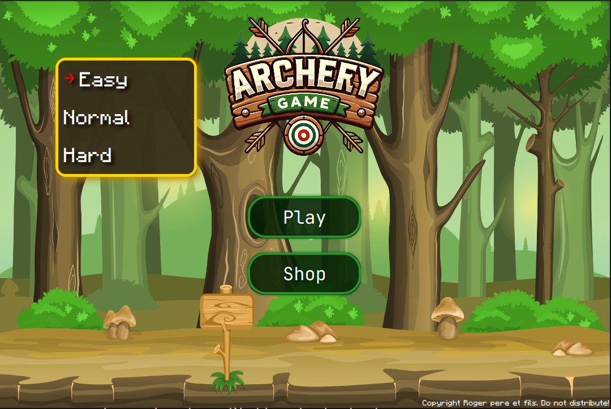
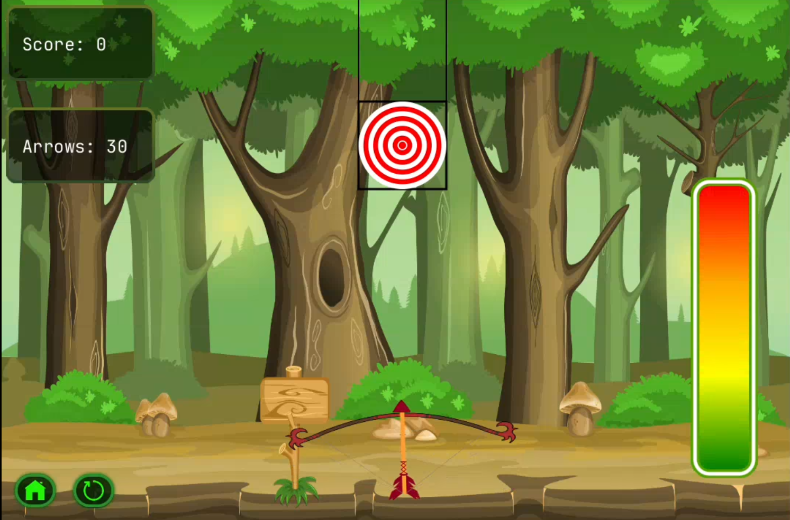
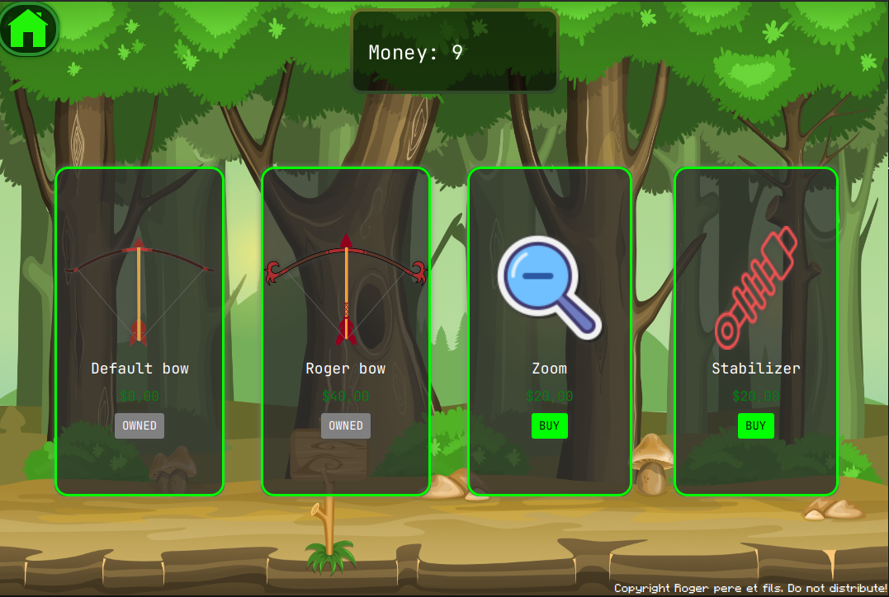

Game project: Archery
================

## Project's description 

Archery is an archery game where the aim is to shoot as close as possible to a target from a distance that can vary.

The project is developed in Java (SDK 21) with Neovim on Ubuntu 24.04.1 LTS. It is managed by the Gradle production engine and incorporates several external libraries such as JavaFX (version 22.0.2), Gson (2.8.9), JUnit (version 5.11.3), and Mockito (4.11.0).

The project is built with advanced design patterns to ensure maintainable and high-performance code while adhering to modern software architecture principles. It is structured using the MVP (Model-View-Presenter) pattern, with test coverage rigorously tracked and Continuous Integration (CI) processes seamlessly integrated into the development workflow. Version control systems and CI tools are effectively used to manage and streamline development.

## Deliverable

Once you have obtained *Archery.jar* by downloading it or by building it with gradle, issue this command in the terminal:
```
java -jar /path/to/Archery.jar
```
## Structure of project

The project has the following structure:

      .
      ├── build.gradle
      ├── settings.gradle
      ├── LICENSE
      ├── README.md
      └── src
          ├── main
          │   ├── java
          │   │   └── fr
          │   │       └── ensicaen
          │   │           └── ecole
          │   │               └── archery
          │   │                   ├── Main.java
          │   │                   ├── MainApplication.java
          │   │                   ├── app
          │   │                   │   └── *.java
          │   │                   ├── data
          │   │                   │   └── *.java
          │   │                   ├── model
          │   │                   │   └── *.java
          │   │                   ├── presenter
          │   │                   │   └── *.java
          │   │                   └── view
          │   │                       └── *.java
          │   └── resources
          │       └── fr
          │           └── ensicaen
          │               └── ecole
          │                   └── archery
          │                       ├── fonts
          │                       │   └── MinecraftRegular-Bmg3.otf
          │                       ├── images
          │                       │   └── *.png
          │                       └── maps
          │                           └── maps.json
          └── test
              └── java
                  └── fr
                      └── ensicaen
                          └── ecole
                              └── archery
                                  ├── app
                                  │   └── *.java
                                  ├── data
                                  │   └── *.java
                                  ├── model
                                  │   └── *.java
                                  └── presenter
                                      └── *.java

The src folder is the source code folder and is divided into two subfolders:
- main, containing all java classes and resources useful to the project.
- test, containing all tests required for java classes.

The gradle files ensure that project construction runs properly.

## Visuals

Here are some screenshots of the game:

- **Game Start Menu**  

- **Gameplay Screen**  

- **Shop Screen**  


## License
This project is licensed under the MIT License.
You are free to use, modify, and distribute this software in accordance with the license terms.
